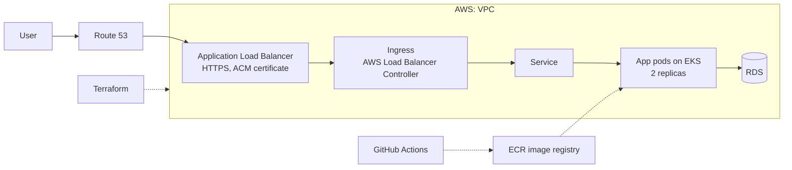

# Arabic Vocabulary App: Production-Style EKS Deployment on AWS

This project deploys a containerised Arabic vocabulary learning app (React frontend, Node.js backend, SM-2 spaced repetition) on AWS EKS (Elastic Kubernetes Service). The infrastructure is provisioned with Terraform for consistency and repeatability, the app is exposed securely over HTTPS through an Application Load Balancer, and a GitHub Actions pipeline automates building and containerising the application.

> **Status:** the cluster is torn down between sessions to control cost, so there is no live demo. The screenshot below is from a real deployment.

## Tech Stack

- **AWS:** EKS, VPC, RDS, ECR, Route 53, ACM, IAM and CloudWatch provide the compute, networking, database, registry, DNS and certificates.
- **Terraform:** provisions and manages the whole AWS footprint as code.
- **Kubernetes:** orchestrates the containerised workload for scalability and reliability.
- **Helm:** installs the AWS Load Balancer Controller into the cluster.
- **Docker:** containerises the app so it runs the same everywhere.
- **GitHub Actions:** automates application builds and containerisation.

## Architecture Diagram

## Architecture

The deployment is designed around repeatable infrastructure, secure traffic and a clear delivery path. The components are:

- **Route 53 and ALB:** DNS routing is handled by Route 53. HTTPS traffic is terminated at an Application Load Balancer using a certificate issued by AWS Certificate Manager, and HTTP requests are redirected to HTTPS.
- **EKS cluster:** the application runs as a Kubernetes Deployment with two replicas on an EKS cluster, exposed through a Service and an Ingress.
- **AWS Load Balancer Controller:** installed with Helm, it watches the Ingress resource and provisions and configures the ALB automatically, so the load balancer is driven by Kubernetes rather than created by hand.
- **RDS:** a managed database, reachable from the cluster through security group rules scoped to the EKS cluster.
- **Terraform:** the VPC, EKS cluster and IAM roles, RDS, ECR repository, security groups, Route 53 zone, ACM certificate and CloudWatch resources are all defined as code.
- **CI/CD pipeline:** GitHub Actions automates application builds and containerisation, publishing images to ECR.

## Features

**Declarative infrastructure**
- The VPC, EKS cluster, RDS instance, security groups and DNS are all provisioned with Terraform, so the environment can be rebuilt from code.
- IAM roles for service accounts (IRSA/OIDC) give workloads scoped AWS permissions instead of broad node-level access.

**Secure networking**
- Route 53 handles DNS and the ALB terminates TLS with an ACM certificate.
- Kubernetes Ingress routes external traffic to the application Service.
- Security groups restrict database access to the EKS cluster.

**Automated delivery**
- GitHub Actions builds the Docker image on every change.
- Images are stored in ECR and pulled by the EKS workload.

**Kubernetes deployment**
- The app runs with two replicas, and the Deployment keeps them running and healthy.
- Manifests for the Deployment, Service and Ingress live in the `k8s/` directory.

## Deployment Evidence

## Migrations

**ECS Fargate to EKS:** the app originally ran on ECS Fargate. I migrated it to Kubernetes and rebuilt the delivery path around Ingress, the AWS Load Balancer Controller and ACM.

**Cross-account move:** when the original AWS account's credits ran out, I moved the whole platform (Terraform state, EKS cluster, RDS, ECR image, Route 53 zone and ACM certificate) to a new AWS account and verified it end to end.

## Next Steps

- **Remote Terraform state:** use S3 for state storage and DynamoDB for locking.
- **Monitoring:** add Prometheus and Grafana for cluster and application metrics, dashboards and alerting.
- **GitOps:** introduce ArgoCD so the cluster state always matches what is defined in Git.
- **Security:** image vulnerability scanning in CI, least-privilege IAM, AWS Secrets Manager, network policies and pod security standards.
- **Terraform modules and CI/CD gates:** reusable modules, plus plan/apply approval steps in the pipeline.
- **Scaling:** horizontal pod autoscaling and node autoscaling with Karpenter.
